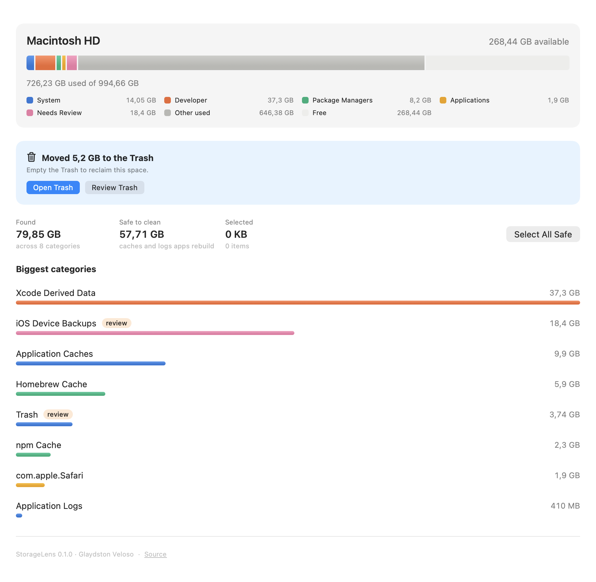

# StorageLens

A native SwiftUI app for macOS that shows where your disk space went and
reclaims the parts that are safe to lose — caches, logs, build artifacts, and
the Trash.

Everything it removes goes to the Trash. The only exception is the Trash
itself, which is flagged in the UI and asks for a separate confirmation.

| | |
| --- | --- |
| **Version** | 0.1.0 |
| **Author** | Glaydston Veloso |
| **Repository** | https://github.com/glaydston/storagelens |
| **License** | MIT |
| **Requires** | macOS 14 (Sonoma) or later, Apple silicon or Intel |
| **Languages** | English, Português (Brasil), Español — follows your system language |

---



The volume bar is the same idea as System Settings → Storage: one colored
segment per group, the unscanned remainder in grey, free space as the track.
Colors belong to the group, not to the size rank, so a category keeps its color
after a clean reorders the list. The palette is validated for colorblind
separation and contrast in both light and dark appearance, and every segment is
named in the legend — color is never the only cue.


## Install

### For anyone (no developer tools needed)

1. Go to the [Releases page](https://github.com/glaydston/storagelens/releases)
   and download **`StorageLens-<version>.dmg`** from the newest release.
2. Open it and drag **StorageLens** onto the **Applications** shortcut in the
   window. That's the install.
3. **First launch:** the app is signed ad-hoc rather than notarized, so
   Gatekeeper refuses to open it by double-click. Right-click the app in
   Applications → **Open** → **Open**. You only do this once. The command-line
   equivalent:

   ```sh
   xattr -dr com.apple.quarantine /Applications/StorageLens.app
   ```

4. Optional: grant **Full Disk Access** (see below) so protected folders can be
   measured too.

The DMG carries a short first-launch note in all three languages. A plain
`StorageLens.zip` is attached to each release too, for anyone who prefers it.

After that it behaves like any other app — Launchpad, Spotlight, Dock.

### For developers

```sh
git clone git@github.com:glaydston/storagelens.git
cd storagelens
make install     # builds and copies to /Applications
```

Or open `Package.swift` in Xcode and run the `StorageLens` scheme.

## Using it

The app scans on launch — a progress bar sits at the bottom of the sidebar
while it works, and categories fill in as their sizes land.

1. **Overview** shows the volume gauge, how much was found, how much of it is
   safe to clean, and the biggest categories. Click a bar to jump to it.
2. **Select All Safe** ticks every cache and log category. Items in *Needs
   Review* are never ticked for you.
3. Open any category to tick individual items. Each row shows its size, when it
   was last modified, and a button to reveal it in Finder.
4. The toolbar button on the right shows how much your selection would free.
   Click it, confirm, and the items go to the Trash.
5. **Empty the Trash to actually get the space back.** Until you do, those
   files still occupy the disk. After a clean the app says so and gives you
   **Open Trash** (opens it in Finder) and **Review Trash** (opens the Trash
   category here, where you can delete permanently). ⇧⌘T opens the Trash any
   time, and every category has an **Open in Finder** button.

The app refreshes itself after a clean — cleaned rows disappear, the volume bar
re-reads, and the Trash category re-scans. No manual rescan needed.

Nothing is ever removed without a selection and a confirmation. There is no
auto-clean and no background agent.

### What it scans

| Group | Included |
| --- | --- |
| System | Trash, `~/Library/Caches`, `~/Library/Logs`, crash reports |
| Developer | Xcode DerivedData / Archives / iOS DeviceSupport, simulator caches, SwiftPM cache |
| Package managers | Homebrew, npm, Yarn, pnpm, pip, uv, Go, Cargo, Gradle, CocoaPods, Deno |
| Applications | Per-app cache folders inside `~/Library/Containers` |
| Needs review | iOS device backups, `~/Downloads`, Mail attachments |

Categories are either **safe** (caches an app rebuilds — covered by *Select All
Safe*) or **needs review** (real data, or artifacts that are expensive to
recreate, like Xcode Archives and their dSYMs).

### Full Disk Access

The app is deliberately **not sandboxed** — a sandboxed app can't see
`~/Library/Caches` or the Trash at all. Most folders work right away. For the
protected ones (Mail, some app containers), grant access:

> System Settings → Privacy & Security → Full Disk Access → **+** → select
> `/Applications/StorageLens.app`, then quit and reopen the app.

The grant is tied to where the app lives, so install it to `/Applications`
*first* and grant access after. When a scan hits a folder it can't read, the
Overview shows a banner with a button that opens the right settings pane.

## Safety model

Deleting files is the whole point of the app, so the destructive path is narrow
and covered by tests:

1. **Allow-list.** Every removal is validated against the roots derived from the
   rule catalog. A path outside them is refused even if the UI somehow offered
   it (`SafetyGuard.validate`).
2. **Contents, never the container.** Rules target the *children* of a root. The
   root itself is rejected, so `~/Library/Caches` can be emptied but never
   removed.
3. **Symlinks are removed, not followed.** The parent directory is resolved
   before validation — so `caches/link -> /System` can't smuggle a path past the
   allow-list — while the final component is left unresolved, so a symlink is
   deleted as a link and its target is untouched.
4. **Protected prefixes.** `/System`, `/usr`, `/Applications`,
   `/private/var/db` and friends are rejected unconditionally, as are paths
   shallower than five components.
5. **Trash, not `rm`.** `FileManager.trashItem` everywhere except the Trash
   category, which is `.permanent` and confirms separately.
6. **Nothing happens without a tick.** No auto-clean, no scheduled runs. Sizes
   are measured; removal waits for an explicit selection and a confirmation.

Sizes are *allocated size on disk* (`totalFileAllocatedSize`), the same number
Finder reports, so the freed total matches what the volume gauge moves by.
Purgeable space is not counted — macOS reclaims that on its own.

## Development

```sh
make test      # 23 tests; they only touch a temp directory
make app       # assembles build/StorageLens.app
make run       # build + launch
make install   # build + copy to /Applications
make zip       # build/StorageLens.zip, the release artifact
make dmg       # build/StorageLens-<version>.dmg, the installer
make icon      # regenerates Resources/AppIcon.icns
make snapshots # regenerates the README screenshots from preview data
```

`make snapshots` runs `StorageLens --snapshot <path> [--dark]`, which renders
the Overview from a fixture and exits — no window, no real scan — so the
screenshots in this README stay in step with the code.

### Layout

```
Sources/StorageLensKit/   scanning, rules, safety, removal — no UI, fully tested
  CleanupRule.swift       the catalog of what's cleanable
  DiskScanner.swift       read-only sizing, concurrent per rule
  SafetyGuard.swift       allow-list validation
  Cleaner.swift           removal, behind an injectable FileOperations
Sources/StorageLens/      SwiftUI app: AppInfo, ScanModel, views
Tests/StorageLensKitTests/
Localizations/            en / pt-BR / es-ES .lproj tables
Scripts/build-app.sh      binary -> .app bundle -> ad-hoc signature
Scripts/make-dmg.sh       .app -> drag-to-Applications installer
Scripts/make-icon.swift   regenerates Resources/AppIcon.icns
```

The logic lives in a library target so it can be tested without launching a UI;
the executable target is only the app shell and views.

### Localization

The app ships English, `pt-BR` and `es-ES` as `.lproj` folders under
`Localizations/`, copied into `Contents/Resources` by the bundle script and
resolved through `Bundle.main`.

Keys **are** the English source strings, so a missing translation falls back to
en-US on its own — `NSLocalizedString` returns the key it was given. Views call
`L("…")` / `LPlural("…", count)` rather than relying on SwiftUI's implicit
lookup, so strings built from variables (category titles, sizes, counts)
localize the same way literals do. Counts go through `Localizable.stringsdict`,
which is why "0 item" is correct in pt-BR and "0 ítems" in es-ES.

To add a language: copy `Localizations/en.lproj` to `<code>.lproj`, translate
the values, and add the code to `CFBundleLocalizations` in
`Scripts/build-app.sh`. To check it, render the Overview in that locale:

```sh
build/StorageLens.app/Contents/MacOS/StorageLens --snapshot out.png -AppleLanguages "(pt-BR)"
```

### Adding a category

Append a `CleanupRule` in `CleanupCatalog.rules`. Anything reachable through a
rule is automatically inside the allow-list, and `.risk = .review` keeps it out
of *Select All Safe*. The catalog tests assert that identifiers stay unique and
that every root stays inside the home directory.

## Publishing

`.github/workflows/ci.yml` builds, tests, and bundles the app on every push and
pull request against `main`.

`.github/workflows/release.yml` fires on a version tag and attaches a
downloadable zip to a GitHub release:

```sh
# 1. bump AppInfo.version (the single source of truth the bundle reads)
# 2. commit, then:
git tag v0.1.0
git push origin v0.1.0
```

Each release carries the DMG installer and a zip. Both keep the bundle's code
signature — `make dmg` and `make zip` use `ditto`/`hdiutil` rather than `zip`.

One rough edge remains for downloaders: releases are **ad-hoc signed, not
notarized**, so Gatekeeper makes every new user right-click → Open the first
time. Removing that step means signing with a Developer ID certificate and
notarizing with `xcrun notarytool` in the release job — it needs a paid Apple
Developer account, with the certificate and an app-specific password stored as
repository secrets.

## Prior art

Worth knowing about before extending this:
[PureMac](https://github.com/momenbasel/PureMac) (SwiftUI cleaner, the closest
equivalent), [Radix](https://github.com/colinvkim/Radix) (fast disk analyzer),
[MangoDisk](https://github.com/harry0703/MangoDisk) (analyzer plus duplicate
finder).

## License

MIT — see [LICENSE](LICENSE). © 2026 Glaydston Veloso.
